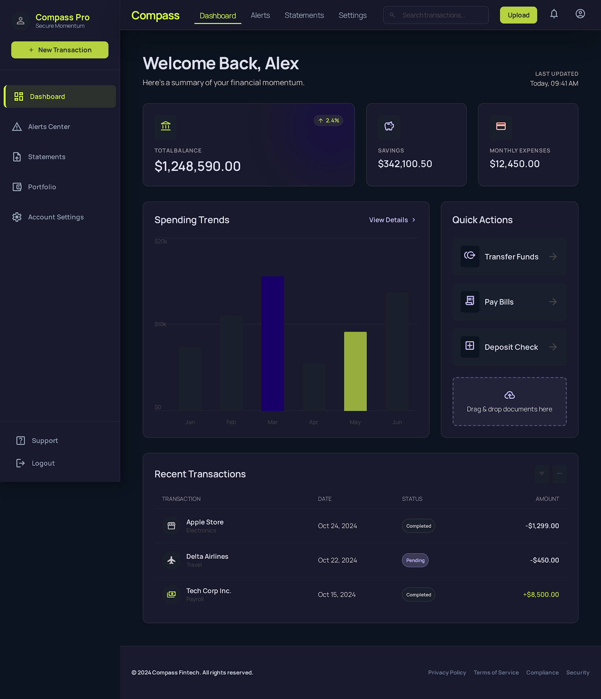
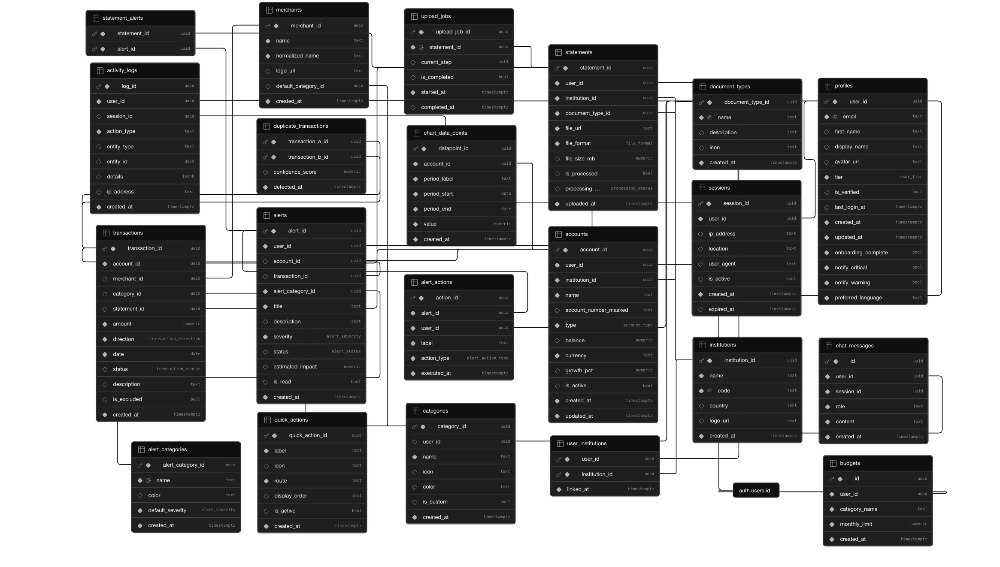

# Compass — Personal Finance Management Platform

## Overview

Compass is a bilingual (Hebrew/English) personal finance web app where users upload PDF or CSV bank statements and AI automatically extracts every transaction, categorises it, and surfaces spending insights, proactive alerts, and budget tracking — all without connecting bank credentials to a third party.

---

## What Problem Does the Project Solve

Most people have no real-time picture of their finances: they juggle multiple bank apps, never look at PDFs that arrive by email, and only notice problems (duplicate charges, budget overruns, unusually large fees) after the money is already gone. Compass turns a passive document dump into an active, searchable, alert-driven financial dashboard — in minutes, not hours.

---

## Target Audience

**Primary:** Individuals in Israel (and Hebrew-speaking markets) who receive monthly bank or credit-card statements and want to understand their spending without connecting their bank login to a third-party service.  
**Situation:** Someone who opens their PDF statement, thinks "I should track this," and then never does — Compass is the tool that removes that friction entirely.

---

## Competitors & Differentiation

| Competitor | What they offer | How Compass is different |
|---|---|---|
| **Excel / Google Sheets** | Full control, free | Zero automation — manual entry, no alerts, no AI |
| **Bank apps** | Real-time balance, basic history | Siloed per-bank, no cross-account view, no analysis |
| **Mint / YNAB** | Full-featured budgeting | Require direct bank login (credential sharing), not available in Israel |
| **WhatsApp groups / family tracking** | Social accountability | No data, no history, no privacy |
| **Cleo / Emma (EU apps)** | AI-powered finance chat | Not localised for Israel, require open-banking API |
| **RiseUp** | Israeli personal finance app with bank-sync and spending insights | Requires sharing bank credentials via screen-scraping; Compass uses document upload only — no credentials ever shared |
| **Doing nothing** | Free | Most common "competitor" — Compass removes the activation barrier |

**Compass's edge:** upload a PDF → done. No credentials shared, full Hebrew RTL support, AI-parsed automatically, proactive alerts fire before you notice a problem.

---

## Live Project

**[https://compass-frontend-steel.vercel.app/](https://compass-frontend-steel.vercel.app/)**

### Dashboard Preview



### Database Schema



---

## Getting Started

```bash
# Install dependencies
npm install

# Start dev server (http://localhost:5173)
npm run dev

# Build for production
npm run build
```

### Environment Variables

Create `.env.local` in the project root:

```env
VITE_SUPABASE_URL=https://your-project.supabase.co
VITE_SUPABASE_ANON_KEY=your-anon-key
VITE_STRIPE_PUBLISHABLE_KEY=pk_live_...
VITE_USE_MOCK_AUTH=false
```

Supabase Edge Function secrets (set via Supabase dashboard → Settings → Secrets):

```
OPENAI_API_KEY=sk-...
STRIPE_SECRET_KEY=sk_live_...
STRIPE_WEBHOOK_SECRET=whsec_...
SUPABASE_SERVICE_ROLE_KEY=...
```

---

## What the Application Does

| Feature | Description |
|---------|-------------|
| **Statement Upload** | 4-step wizard: choose type → upload PDF/CSV → AI preview → review & save. OpenAI extracts date, amount, description, direction from raw text. |
| **Dashboard** | KPI cards (total balance, savings, monthly expenses with % trend badges), 6-month spending bar chart, recent transactions table. Skeleton loading while data fetches. |
| **Alerts Center** | Proactive alerts for unusual charges, duplicate billings, budget overruns, and optimization opportunities. Filterable by severity (Critical / Opportunities / Duplicates). |
| **Insights** | AI-powered spending breakdown — stat cards, 6-month trend chart, budget progress bars, and category breakdown. Pro-tier only. |
| **Transactions** | Full searchable, filterable transaction list with merchant names, categories, dates, and amounts. CSV export with currency column. |
| **Budget Tracking** | Set monthly limits per category in Settings. Progress bars on Insights show % used with green/yellow/red colour coding and over-budget alerts. |
| **Pro / Free Tiers** | Free users get limited accounts and uploads. Pro unlocks unlimited uploads, AI insights, and budget alerts via Stripe subscription (₪39.90/month). 14-day trial included. |
| **Bilingual UI** | Full Hebrew (RTL) and English (LTR) support across all pages, toggled from the footer. |
| **Auth** | Email/password and Google SSO via Supabase Auth. |
| **AI Chat** | Floating Compass AI widget powered by OpenAI — ask questions about spending, trends, and savings in natural language. |
| **Empty & Loading States** | Every page has a meaningful empty state with an upload CTA. KPI section uses shimmer skeleton cards instead of a full-page spinner. |

---

## Tech Stack & Third-Party Integrations

| Service / Library | Category | Purpose |
|-------------------|----------|---------|
| **React 18** | Frontend Framework | UI rendering, component model |
| **Vite 5** | Build Tool | Dev server, bundling, HMR |
| **React Router DOM v6** | Routing | Client-side SPA navigation |
| **Vanilla CSS Modules** | Styling | Scoped component styles; no UI library |
| **Supabase (PostgreSQL)** | Database | All app data with Row-Level Security on every table |
| **Supabase Auth** | Authentication | Email/password + Google OAuth; JWT session management |
| **Supabase Storage** | File Storage | `avatars` bucket for user profile pictures (public, RLS-protected per user) |
| **Supabase Edge Functions** | Serverless | Deno-based server-side functions: `parse-statement` (AI parsing), `create-checkout-session` (Stripe), `stripe-webhook` (tier updates), `delete-account` (GDPR-safe account deletion via service role) |
| **OpenAI (gpt-4o-mini)** | AI / ML | PDF statement parsing and AI chat assistant |
| **Stripe** | Payments | Subscription checkout (Pro tier), webhook for tier updates |
| **pdfjs-dist** | PDF Parsing | Client-side PDF text extraction before sending to AI |
| **papaparse** | CSV | Client-side CSV export of transactions |
| **Google OAuth** | Authentication | Sign in with Google via Supabase Auth provider |
| **Vercel** | Hosting | Static SPA hosting with rewrite rules (`vercel.json`) |
| **Material Symbols** | Icons | Google icon font loaded via CDN |

---

## Deployment

Deployed on **Vercel**. The `vercel.json` rewrites all routes to `index.html` for SPA support:

```json
{ "rewrites": [{ "source": "/(.*)", "destination": "/index.html" }] }
```

After deploying, add your Vercel URL to **Supabase → Authentication → URL Configuration** as the Site URL and a redirect URL.

---

## Database Schema

Full Supabase PostgreSQL schema. All user-facing tables are protected by Row-Level Security (RLS).

### Table `profiles`

| Column | Type | Constraints |
|--------|------|-------------|
| `user_id` | `uuid` | Primary |
| `email` | `text` | Unique |
| `first_name` | `text` | Nullable |
| `display_name` | `text` | Nullable |
| `avatar_url` | `text` | Nullable |
| `tier` | `user_tier` | |
| `is_verified` | `bool` | Nullable |
| `last_login_at` | `timestamptz` | Nullable |
| `created_at` | `timestamptz` | |
| `updated_at` | `timestamptz` | |
| `onboarding_complete` | `bool` | |
| `notify_critical` | `bool` | |
| `notify_warning` | `bool` | |
| `preferred_language` | `text` | |

### Table `sessions`

| Column | Type | Constraints |
|--------|------|-------------|
| `session_id` | `uuid` | Primary |
| `user_id` | `uuid` | |
| `ip_address` | `text` | Nullable |
| `location` | `text` | Nullable |
| `user_agent` | `text` | Nullable |
| `is_active` | `bool` | Nullable |
| `created_at` | `timestamptz` | |
| `expired_at` | `timestamptz` | Nullable |

### Table `institutions`

| Column | Type | Constraints |
|--------|------|-------------|
| `institution_id` | `uuid` | Primary |
| `name` | `text` | |
| `code` | `text` | Unique |
| `country` | `text` | Nullable |
| `logo_url` | `text` | Nullable |
| `created_at` | `timestamptz` | |

### Table `accounts`

| Column | Type | Constraints |
|--------|------|-------------|
| `account_id` | `uuid` | Primary |
| `user_id` | `uuid` | |
| `institution_id` | `uuid` | |
| `name` | `text` | |
| `account_number_masked` | `text` | Nullable |
| `type` | `account_type` | |
| `balance` | `numeric` | Nullable |
| `currency` | `text` | |
| `growth_pct` | `numeric` | Nullable |
| `is_active` | `bool` | Nullable |
| `created_at` | `timestamptz` | |
| `updated_at` | `timestamptz` | |

### Table `document_types`

| Column | Type | Constraints |
|--------|------|-------------|
| `document_type_id` | `uuid` | Primary |
| `name` | `text` | Unique |
| `description` | `text` | Nullable |
| `icon` | `text` | Nullable |
| `created_at` | `timestamptz` | |

### Table `statements`

| Column | Type | Constraints |
|--------|------|-------------|
| `statement_id` | `uuid` | Primary |
| `user_id` | `uuid` | |
| `institution_id` | `uuid` | |
| `document_type_id` | `uuid` | |
| `file_url` | `text` | |
| `file_format` | `file_format` | |
| `file_size_mb` | `numeric` | Nullable |
| `is_processed` | `bool` | Nullable |
| `processing_status` | `processing_status` | Nullable |
| `uploaded_at` | `timestamptz` | |

### Table `upload_jobs`

| Column | Type | Constraints |
|--------|------|-------------|
| `upload_job_id` | `uuid` | Primary |
| `statement_id` | `uuid` | Unique |
| `current_step` | `int4` | Nullable |
| `is_completed` | `bool` | Nullable |
| `started_at` | `timestamptz` | |
| `completed_at` | `timestamptz` | Nullable |

### Table `categories`

| Column | Type | Constraints |
|--------|------|-------------|
| `category_id` | `uuid` | Primary |
| `user_id` | `uuid` | Nullable |
| `name` | `text` | |
| `icon` | `text` | Nullable |
| `color` | `text` | Nullable |
| `is_custom` | `bool` | Nullable |
| `created_at` | `timestamptz` | |

### Table `merchants`

| Column | Type | Constraints |
|--------|------|-------------|
| `merchant_id` | `uuid` | Primary |
| `name` | `text` | |
| `normalized_name` | `text` | |
| `logo_url` | `text` | Nullable |
| `default_category_id` | `uuid` | Nullable |
| `created_at` | `timestamptz` | |

### Table `transactions`

| Column | Type | Constraints |
|--------|------|-------------|
| `transaction_id` | `uuid` | Primary |
| `account_id` | `uuid` | |
| `merchant_id` | `uuid` | Nullable |
| `category_id` | `uuid` | Nullable |
| `statement_id` | `uuid` | Nullable |
| `amount` | `numeric` | |
| `direction` | `transaction_direction` | |
| `date` | `date` | |
| `status` | `transaction_status` | Nullable |
| `description` | `text` | Nullable |
| `is_excluded` | `bool` | Nullable |
| `created_at` | `timestamptz` | |

### Table `alert_categories`

| Column | Type | Constraints |
|--------|------|-------------|
| `alert_category_id` | `uuid` | Primary |
| `name` | `text` | Unique |
| `color` | `text` | Nullable |
| `default_severity` | `alert_severity` | |
| `created_at` | `timestamptz` | |

### Table `alerts`

| Column | Type | Constraints |
|--------|------|-------------|
| `alert_id` | `uuid` | Primary |
| `user_id` | `uuid` | |
| `account_id` | `uuid` | Nullable |
| `transaction_id` | `uuid` | Nullable |
| `alert_category_id` | `uuid` | |
| `title` | `text` | |
| `description` | `text` | Nullable |
| `severity` | `alert_severity` | |
| `status` | `alert_status` | Nullable |
| `estimated_impact` | `numeric` | Nullable |
| `is_read` | `bool` | Nullable |
| `created_at` | `timestamptz` | |

### Table `alert_actions`

| Column | Type | Constraints |
|--------|------|-------------|
| `action_id` | `uuid` | Primary |
| `alert_id` | `uuid` | |
| `user_id` | `uuid` | |
| `label` | `text` | |
| `action_type` | `alert_action_type` | |
| `executed_at` | `timestamptz` | |

### Table `chart_data_points`

| Column | Type | Constraints |
|--------|------|-------------|
| `datapoint_id` | `uuid` | Primary |
| `account_id` | `uuid` | |
| `period_label` | `text` | |
| `period_start` | `date` | |
| `period_end` | `date` | |
| `value` | `numeric` | |
| `created_at` | `timestamptz` | |

### Table `quick_actions`

| Column | Type | Constraints |
|--------|------|-------------|
| `quick_action_id` | `uuid` | Primary |
| `label` | `text` | |
| `icon` | `text` | Nullable |
| `route` | `text` | |
| `display_order` | `int4` | Nullable |
| `is_active` | `bool` | Nullable |
| `created_at` | `timestamptz` | |

### Table `activity_logs`

| Column | Type | Constraints |
|--------|------|-------------|
| `log_id` | `uuid` | Primary |
| `user_id` | `uuid` | |
| `session_id` | `uuid` | Nullable |
| `action_type` | `text` | |
| `entity_type` | `text` | Nullable |
| `entity_id` | `uuid` | Nullable |
| `details` | `jsonb` | Nullable |
| `ip_address` | `text` | Nullable |
| `created_at` | `timestamptz` | |

### Table `user_institutions`

| Column | Type | Constraints |
|--------|------|-------------|
| `user_id` | `uuid` | Primary (composite) |
| `institution_id` | `uuid` | Primary (composite) |
| `linked_at` | `timestamptz` | |

### Table `statement_alerts`

| Column | Type | Constraints |
|--------|------|-------------|
| `statement_id` | `uuid` | Primary (composite) |
| `alert_id` | `uuid` | Primary (composite) |

### Table `duplicate_transactions`

| Column | Type | Constraints |
|--------|------|-------------|
| `transaction_a_id` | `uuid` | Primary (composite) |
| `transaction_b_id` | `uuid` | Primary (composite) |
| `confidence_score` | `numeric` | Nullable |
| `detected_at` | `timestamptz` | |

### Table `chat_messages`

| Column | Type | Constraints |
|--------|------|-------------|
| `id` | `uuid` | Primary |
| `user_id` | `uuid` | |
| `session_id` | `uuid` | |
| `role` | `text` | |
| `content` | `text` | |
| `created_at` | `timestamptz` | |

### Table `budgets`

| Column | Type | Constraints |
|--------|------|-------------|
| `id` | `uuid` | Primary |
| `user_id` | `uuid` | |
| `category_name` | `text` | |
| `monthly_limit` | `numeric` | |
| `created_at` | `timestamptz` | |

---

## Project Structure

```
compass-frontend/
├── public/                          # Static assets
├── Planning/                        # Design docs, wireframes, schema PNG
├── supabase/
│   ├── functions/
│   │   ├── parse-statement/         # Edge Function: OpenAI PDF parsing
│   │   ├── create-checkout-session/ # Edge Function: Stripe checkout
│   │   ├── stripe-webhook/          # Edge Function: Stripe → tier update
│   │   └── delete-account/          # Edge Function: GDPR account deletion (service role)
│   └── migrations/                  # SQL migration files
├── src/
│   ├── App.jsx                      # Route definitions (public, protected, adaptive)
│   ├── main.jsx                     # React entry point + top-level ErrorBoundary
│   ├── styles/                      # Global CSS variables and design tokens
│   │
│   ├── layouts/
│   │   ├── PublicLayout.jsx         # Public navbar + footer (unauthenticated)
│   │   ├── AppLayout.jsx            # App navbar + footer + ChatWidget (authenticated)
│   │   └── AdaptiveLayout.jsx       # Switches navbar based on auth state
│   │
│   ├── context/
│   │   ├── AuthContext.jsx          # Session, user profile, tier state
│   │   ├── LanguageContext.jsx      # i18n — all EN/HE translations + t(), tCat(), tMonth()
│   │   └── CurrencyContext.jsx      # Currency formatting (ILS default)
│   │
│   ├── lib/
│   │   ├── supabase.js              # Supabase client
│   │   ├── auth.js                  # Auth helpers (signIn, signOut, OAuth)
│   │   ├── stripe.js                # redirectToCheckout() via Edge Function
│   │   ├── pdfParser.js             # PDF → text → AI transaction extraction
│   │   ├── alertGenerator.js        # Client-side alert generation logic
│   │   └── exportCsv.js             # papaparse CSV export for transactions
│   │
│   ├── hooks/
│   │   ├── useAccounts.js           # Fetch user accounts
│   │   ├── useTransactions.js       # Fetch transactions with limit param
│   │   ├── useAlerts.js             # Fetch + dismiss alerts
│   │   ├── useChartData.js          # Fetch monthly chart_data_points
│   │   ├── useBudgets.js            # Fetch budgets + compute spent/pct per category
│   │   └── useTier.js               # isPro / isTrialing / trialDaysLeft / limits
│   │
│   ├── components/
│   │   ├── shared/
│   │   │   ├── AppNavbar/           # Authenticated navbar with avatar + tier badge
│   │   │   ├── PublicNavbar/        # Marketing navbar
│   │   │   └── Footer/              # Footer with language toggle + links
│   │   ├── Skeleton/                # Shimmer skeleton bones for loading states
│   │   ├── ErrorBoundary/           # Class-based error boundary wrapping Outlet + ChatWidget
│   │   ├── KPICard/                 # Dashboard metric card with badge + tooltip
│   │   ├── KPIStatsSection/         # 3 KPI cards with computed metrics
│   │   ├── ExpenseChartSection/     # Bar chart — spending trends with avg line
│   │   ├── BudgetProgressSection/   # Progress bars per category (green/yellow/red)
│   │   ├── RecentTransactionsSection/ # Transaction table component
│   │   ├── AlertsBannerSection/     # Dismissable alert banners on dashboard
│   │   ├── AlertsListSection/       # Full alert list with filter/sort
│   │   ├── ChatWidget/              # Floating AI chat (OpenAI via Edge Function)
│   │   ├── ProGate/                 # Blurs content + upgrade CTA for Free users
│   │   └── ...                      # 40+ additional UI components
│   │
│   └── pages/
│       ├── LandingPage/             # Marketing homepage
│       ├── LoginPage/               # Email + Google SSO login
│       ├── RegisterPage/            # Sign up
│       ├── ForgotPasswordPage/      # Password reset
│       ├── DashboardPage/           # Main authenticated dashboard
│       ├── AlertsPage/              # Full alerts center
│       ├── InsightsPage/            # AI insights (Pro-gated)
│       ├── TransactionsPage/        # Full transaction list with search/filter/export
│       ├── UploadPage/              # 4-step statement upload wizard
│       ├── SettingsPage/            # Currency, notifications, budgets, danger zone
│       ├── ProfilePage/             # Avatar upload, personal info, password change
│       ├── PricingPage/             # Free vs Pro plan comparison
│       ├── UpgradePage/             # Pro upgrade CTA → Stripe checkout
│       ├── AboutPage/               # Company/product info
│       ├── PrivacyPage/             # Privacy policy
│       ├── TermsPage/               # Terms of service
│       ├── ContactPage/             # Contact form
│       └── NotFoundPage/            # 404
```
